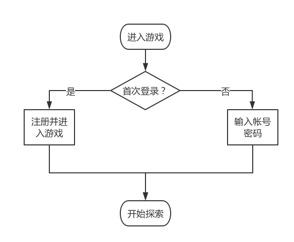
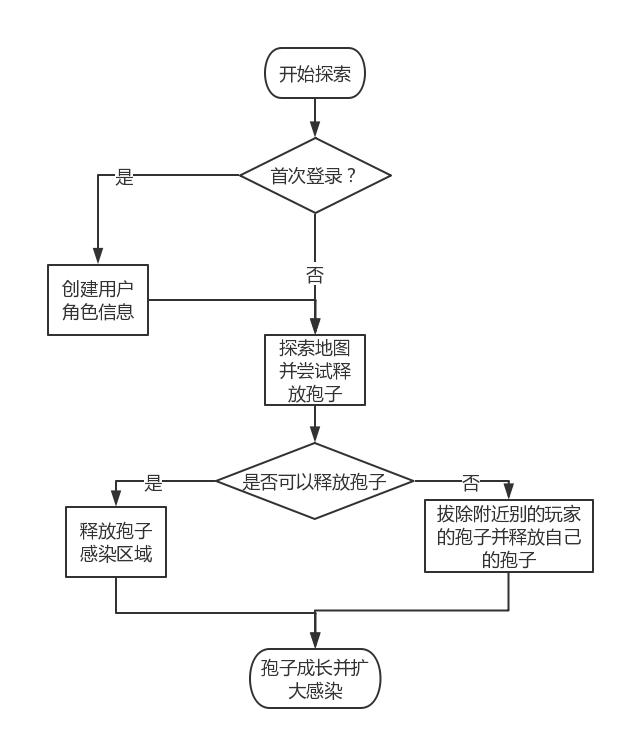
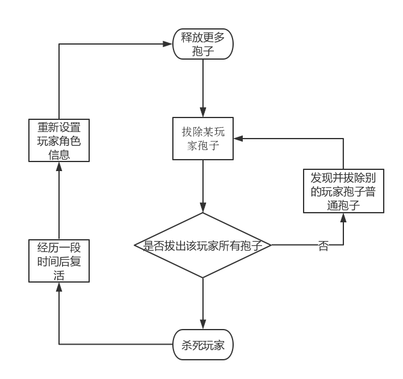
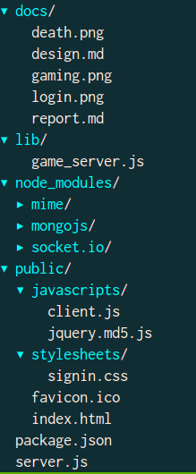
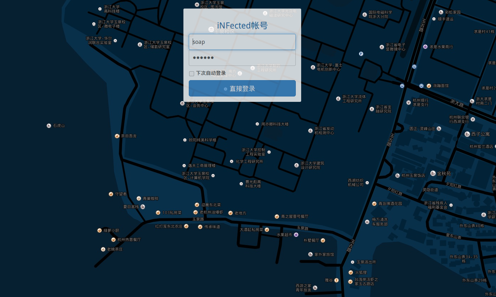
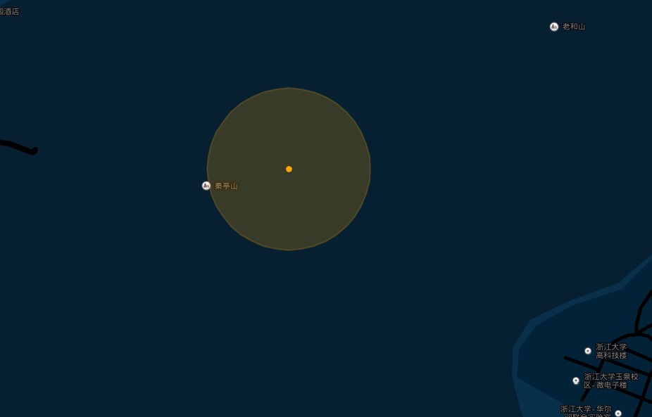
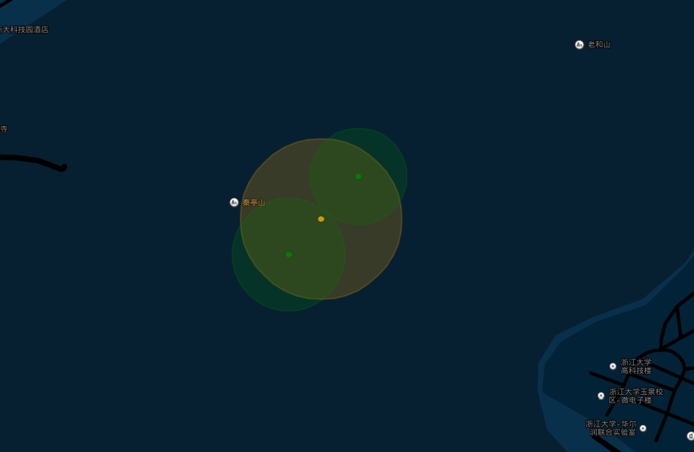
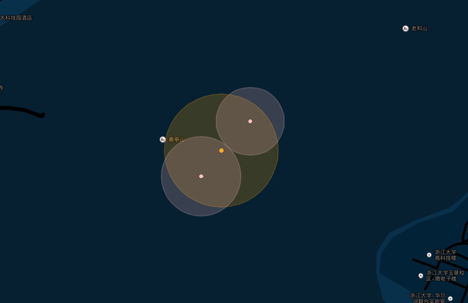

# 基于地理位置信息的HTML对战游戏
## 项目描述
本项目是一个基于地理位置信息的网页对战游戏，根据在线玩家的位置信息实现玩家之间的互动，设计灵感来源于著名移动端游戏《瘟疫公司》。主要玩法是玩家在不同的地方释放“孢子”并感染、占领附近地域，以获取胜利。游戏基于真实的地理位置，对位置信息的准确度以及移动需求比较高，因此游戏在移动终端上体验更好。

### 登录逻辑
打开页面后进入登录界面，判断是否为初次登录。如果是初次登录，则用户注册并进入游戏，将当前地点设置为出生地点。否则直接登录。进入游戏后即可开始探索。

### 基本游戏逻辑
玩家登录后，地图会立刻移动到用户所在地理位置，并在地图上以橙色点标记，且在玩家周围会出现一个半径100m的高亮区域，这个区域表示玩家的势力范围，玩家所有的操作只能限制在这个区域内，称为玩家的核心区。玩家自己释放的孢子会以绿色点标记，并也通过圆形高亮显示孢子的影响范围，这个范围称为感染区。别的玩家的孢子会以同样的形式显示，只不过颜色为粉色。

玩家可以在核心区内释放自己的孢子，但不能在别的玩家的感染区内或和别的玩家的感染区相交。释放的孢子初始影响半径为30m，且释放的孢子会以一定的速度扩散，感染附近的区域。玩家的所有感染区之和就是玩家所占领的区域。为了占领区域，玩家除了需要用自己的孢子感染区域，还需要寻找并拔除别的玩家的孢子。

别的玩家的孢子不会直接显示在地图上，只有当玩家接近后（被玩家核心区覆盖）才会显示，因此玩家需要主动找到别的玩家释放的孢子并拔除之。被玩家占领的区域不能被别的玩家释放孢子，除非玩家的孢子被拔除。

### 获胜机制
本游戏偏向沙盒性质，本游戏没有玩家之间的直接对战，玩家所需做的就是不停地占领区域，并毁坏别人的区域。玩家的之间通过互相拔除孢子来进行竞技。玩家每拔除一个别的玩家的孢子，就会更新一次玩家的战绩，所有玩家的战绩会被定时统计，并通过排行榜显示在游戏界面上。

### 死亡机制
拔除玩家的根孢子将杀死玩家，玩家可以通过这种方式进行自行约战。别的玩家的根孢子不会像普通孢子那样接近后就会显示出来，除非玩家的其他孢子都被拔除。一旦玩家被杀死，经历一段复活时间后玩家可复活，然后玩家可以重新设置孢子并重新开始游戏。

- - -

## 技术选型
### 前端
前端选用以下技术：
- HTML5
- Javascript
- 百度地图API

#### HTML5
编写基本页面，展示基本页面元素，游戏内容，登录逻辑等。

#### Javascript
用于实现交互逻辑，如位置获取、长按事件、右键事件等。以及调用地图API。

#### 百度地图API

地图作为本游戏的核心组件，重要程度不言而喻。考虑到要与网页对接，速度要求比较高，因此采用了百度地图的Javasript大众版API。百度地图JavaScript API是一套由JavaScript语言编写的应用程序接口，可用来在网站中构建功能丰富、交互性强的地图应用，支持PC端和移动端基于浏览器的地图应用开发，且支持HTML5特性的地图开发。并且该套API对非商业目的开发项目免费开放。本游戏主要将会运用到以下功能：

- 地图展示：基本的地图展示以及定位
- 覆盖物图层：已感染区域可使用颜色覆盖图层实现

### 服务端
服务端选用以下基本技术：

- Node.js
- MongoDB
- JSON

#### Node.js
服务端采用Node.js编写，Node采用事件驱动型非阻塞式I/O，运行于Google V8引擎，较为适合多人在线游戏的服务端编写。服务端采用Debian jessie发行版。

#### Json
前端和服务端之间使用JSON文件进行数据传输，JSON是一种标记语言，相较XML，JSON体积更小，更适合网络传输，也比价适合和Node.js搭配。

#### MongoDB
游戏的基本数据都存储在数据库中，由于项目比较小，并且考虑到Node.js和JSON的支持，数据库适合使用MongoDB，方便快速部署网站。

### 数据
游戏主要的数据包括维护每一个用户的账户信息。另外，每一个用户作为一个实例，需要维护他的游戏信息，包括已释放孢子以及各个孢子的位置、已拔除的孢子数目、死亡信息等。数据结构比较简单，因此适合使用JSON传输。

- - -

## 主要实现细节
### 数据库
使用mongodb存储数据，具体数据结构如下

#### users

    {
      uname   : string,
      passwd  : string,
      regdate : timestamp
    }

#### profiles

    {
      uname    : string,
      killed   : integer,
      dead     : boolean,
      online   : boolean,
      position : { lat : double, lng : double },
      root     : { lat : double, lng : double },
      spores   : [
        { lat : double, lng : double, radius : integer},
        { lat : double, lng : double, radius : integer},
        { lat : double, lng : double, radius : integer},
        { lat : double, lng : double, radius : integer},
        { lat : double, lng : double, radius : integer}
      ]
    }

### 通过Socket.IO实时传输
由于一般游戏对实时性和双向传输要求比较高，因此在登录完成后通过Socket.IO建立连接，通过Socket.IO处理服务器和客户端之间的通讯是一个比较好的选择。Socket.IO为Node及客户端JavaScript提供了基于WebSocket以及其他传输方式的封装，它提供了一个抽象层。如果浏览器没有实现WebSocket，Socket.IO会自动启用一个备选方案，而对外提供的API还是一样的。

如下在登录之后建立Socket.IO连接，并定义了断开连接后进行数据库内容更新的回调函数。

    var socketio = require('socket.io')
    io = socketio.listen(server)
    io.on('connection', function(socket) {
      socket.on('disconnect', function() {
        var spores = new Array
        var count = 0
        for (var id in globalSpores[user.uname]) {
          var spore = globalSpores[user.uname][id]
          spores.push({
            id     : count++,
            lat    : spore.lat,
            lng    : spore.lng,
            radius : spore.radius
          })
        }
        db.profiles.update({uname : user.uname}, {$set : {
          online : false,
          killed : globalKilled[user.uname],
          position : user.position,
          spores : spores
        }})
      })
    }

在Socket.IO中发送消息可以通过`emit`函数实现，比如向所有客户端广播排行榜信息

    io.sockets.emit('top-k', topK)

或者向当前客户端发送更新孢子信息的命令

    socket.emit('mergespores', spores)

### 定位
地理定位采用HTML5自带的定位服务接口HTML5 Geolocation API，接口`navigator.geolocation.getCurrentPosition()`和`navigator.geolocation.watchPosition()`均返回所在地的经纬度信息。如下代码段所示，在登录后主动获取一次当前位置，在地图上绘制当前位置，此后每隔一段时间次获取一次新的位置，调用响应的回调函数更新位置。

    if (navigator.geolocation) {
      navigator.geolocation.getCurrentPosition(function(position) {
        myPosition = new BMap.Point(position.coords.longitude, position.coords.latitude)
        socket.emit('signup', {uname : myName, pos : myPosition})
        map.panTo(myPosition)
        var outer    = new BMap.Circle(myPosition, 100, sporeOptions.root.outer)
        var centroid = new BMap.Circle(myPosition, 3, sporeOptions.root.centroid)
        map.addOverlay(outer)
        map.addOverlay(centroid)
        myOuterMarker    = outer
        myCentroidMarker = centroid
        /* Synchronize the loaction with the server */
        navigator.geolocation.watchPosition(onPositionChanged)
      })
    }

### 孢子扩散
孢子会每隔一定时间扩散一点，孢子会无限制增长，直到遇到别的孢子或者孢子被清除。通过设置一个定时器，定时查看、更新所有孢子。如下代码实现了这一点

    setInterval(function() {
      for (var id in globalSpores[user.uname]) {
        var mySpore = globalSpores[user.uname][id]
        var isolated = true
        for (var otherName in globalSpores) {
          for (var otherId in globalSpores[otherName]) {
            if (user.uname != otherName || id != otherId) {
              var otherSpore = globalSpores[otherName][otherId]
              var dist = getDistance({lat : mySpore.lat, lng : mySpore.lng},
                                      {lat : otherSpore.lat, lng : otherSpore.lng})
              if (dist < mySpore.radius + otherSpore.radius + INCREMENT_RADIUS) {
                isolated = false
                break;
              }
            }
          }
          if (isolated == false)
            break;
        }
        if (isolated == true) {
          mySpore.radius += INCREMENT_RADIUS
        }
      }
    }, 10000)

- - -

## 项目展示
以下是本项目的项目结构

项目结构依赖于mine、mongojs、socket.io三个模块，运行服务端主代码`server.js`即可在本地7001端口架设服务器

    node server.js

### 登录界面

### 登录后我的位置显示

### 释放孢子后我的视角

### 从他人视角观看我的孢子

